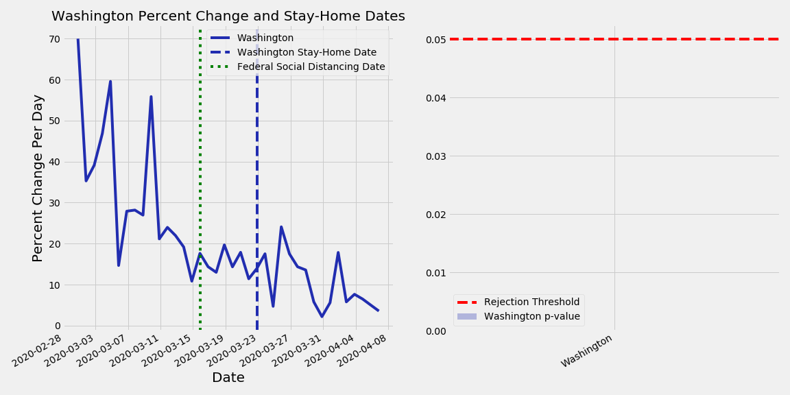
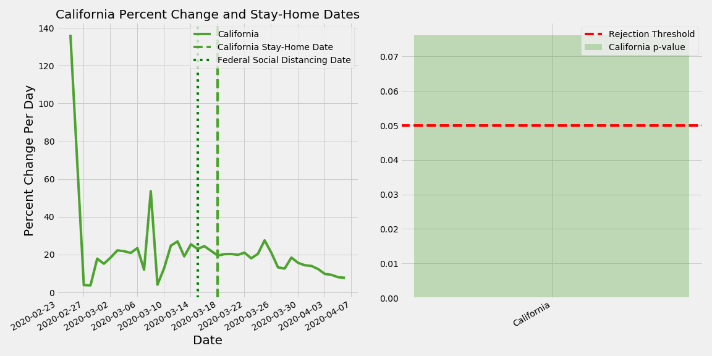
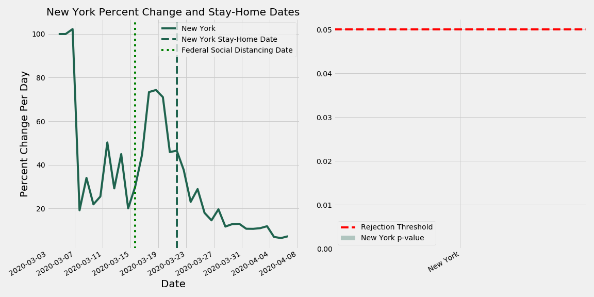
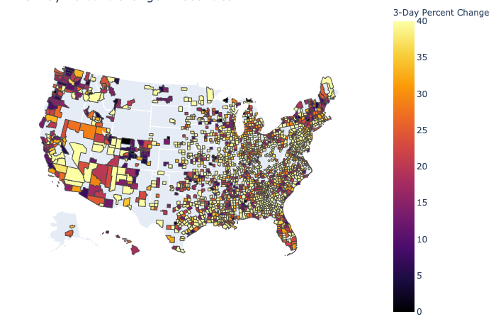

# COVID-19

### This study is to answer the question: 

#### Do social distancing guidelines provide a change in the percent increase of the number of COVID-19 cases that a state reports?

I am not an epidemiologist. This study is being done for educational purposes only and should not be used in any scientific or policy-making way.

The number of reported COVID cases for each day/state was taken from the New York Times' GitHub (https://github.com/nytimes/covid-19-data). 

The date at which the state implemented stay-at-home orders was scraped from: https://www.kff.org/coronavirus-policy-watch/stay-at-home-orders-to-fight-covid19/

### Hypothesis Testing

Each state was given the null hypothesis: The social distancing guidelines do not provide a change in the percent increase of COVID-19 cases that a state reports.

The rejection threshold is shown below.

Rejection Threshold = 0.05

With that null hypothesis, the conditional probability of finding a result equally or more extreme than observed was calculated (the p-value).

For each day, the percent increase in the number of cases from the day before was calculated. Then, that percent increase from before social distancing and after social distancing was used to calcualte the p-value.

#### Percent Increase = (That Day's Cases - Previous Day's Cases) / (Previous Day's Cases) * 100

A graph of each state and the p-value was generated. An example of one state, Washington, is shown below. The p-value is very low, which means that the null hypothesis can be rejected. This signifies that there may be an effect of social distancing on percent increase in reported COVID-19 cases.

Additionally, California is shown below. This state was found to have a high p-value, meaning that the null hypothesis can not be rejected. Additional exploration of the data can be done to look into why.

Lastly, New York is shown below. New York was found to also have a low p-value, similar to Washington.

More states can be observed in the 'All-States-COVID-19.ipynb'

### Further look into:
As more data becomes available in the future, a possible expansion of this study would be to look at social distancing guidelines and stay-at-home orders. 

The question could be: Do stay-at-home orders provide a change in the percent increase of the number of COVID-19 cases vs. social distancing guidelines?

## Additional EDA

An EDA of the 3-day percent change in number of reported cases is shown below. For interactive, see 'choropleth_county.ipynb'

 